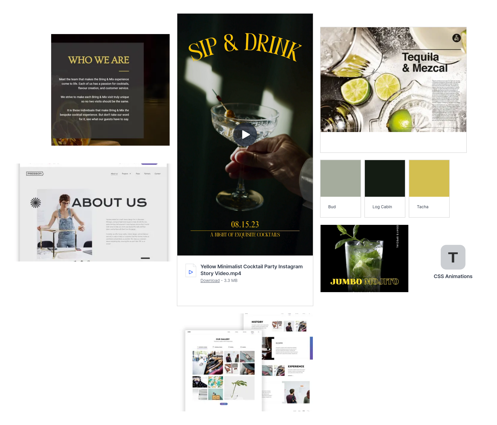
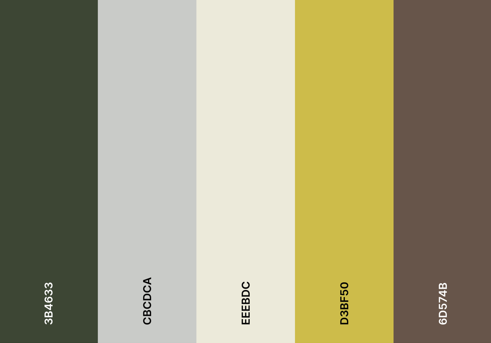

# Mixology Society

# Project Overview

Welcome,

This is the Mixology Society website, which provides information about the University of Luketon's Mixology Society.

The following are high-level details of this project:

- The main technologies used are HTML5, CSS3 and Bootstrap version 5 (framework).
- The project consists of three separate web page sections (Home, About Us & Sign Up).
- A top navigation bar is established for information architecture.
- Git & GitHub are used for version control.
- Any external code sources used in the project are clearly identified in the code itself and in this README.md file
- The final version has been deployed via GitHub Pages.

The last update to this file was: **January 22nd, 2024**

# Table of Contents

- [Mixology Society](#mixology-society)
- [Project Overview](#project-overview)
- [Table of Contents](#table-of-contents)
- [UX](#ux)
  - [User Goals](#user-goals)
  - [User Stories](#user-stories)
  - [Site Owners Goals](#site-owners-goals)
    - [Requirements](#requirements)
    - [Expectations](#expectations)
- [UI / Design Choices](#ui--design-choices)
  - [Moodboard](#moodboard)
  - [Fonts](#fonts)
  - [Icons](#icons)
  - [Colours](#colours)
  - [Breakpoints](#breakpoints)
  - [Wireframes](#wireframes)

# UX

## User Goals

1. Visually appealing, including images.
2. Easily navigated around.
3. Quality and valuable content.
4. Easily found contact details.
5. Form to directly contact the society club.

## User Stories

1. As a user, I want to know that the society club is well established.
2. As a user, I want to be able to easily contact the club.
3. As a user, I want to be able to make contact with the club via different methods, i.e. social media.
4. As a user, I want to be able to easily navigate through the website.
5. As a user, I want to know what events are taking place.
  
## Site Owners Goals

1. Promote the club.
2. Increase the number of members.
3. Increase rankings on search engines.
  
### Requirements

1. Easy to navigate on various screen sizes.
2. Clear information on the services provided.
3. Keep the user interested with the club's values to make them want to engage with the society club.
4. Simple methods of contacting the society club.
5. Visually inviting so users do not leave.
  
### Expectations

1. I expect to know if a form has been submitted properly and if items are not filled in, to be prompted.
2. I expect all links to social media sites to be opened in a new tab.
3. I expect all navigation links to work correctly.
4. I expect screen size not to affect the quality of the website.
5. I expect all information to be correct and accurate.

\
&nbsp;
[Back to Top](#table-of-contents)
\
&nbsp;

# UI / Design Choices

## Moodboard

One of the first milestones of this project was to create a moodboard to help envision the overall house style of the webiite and ensure that all of the sections and elements are cohesive. The software I used to create the moodboard for this website is [Mila Note](https://milanote.com/ "Mila Note").
Below, is the moodboard:

## Fonts

In order to move away from the basic fonts available, I have used
[Google Fonts](https://fonts.google.com/ "Google Fonts") to find a text that best suits the feel of the website. For the main text I have chosen [Glory](https://fonts.google.com/specimen/Glory "Glory font") as I feel it is has a sharp, simple and easy to read look. To make the navigation bar stand out form the text, I decided to use [Inter](https://fonts.google.com/specimen/Inter?query=inter "Inter font"). This font is complimentary to the Glory font, and will help be distinctive as navigation links in the header.

## Icons

I will use some icons for my website from the [Font Awesome library](https://fontawesome.com/ "Font Awesome"). These icons will be used in the About Us Section and also the social media links in the footer. All icons used will be styled and in keeping with the appearance of the website.

## Colours

The colour scheme of the website is inspired by the moodboard (previously depicted). I have used [Coolers](https://coolors.co/ "coolers") to retrieve the desired colour codes and generate the colour palette.

Below, is the color palette:

## Breakpoints

As a starting point, I will be building my website with a mobile first mindset using the iPhone 5/SE (320px) as the smallest screen size for styling to look good on. The screen size breakpoints that I will be using are from [Bootstrap breakpoints](https://getbootstrap.com/docs/5.0/layout/breakpoints/ "Bootstrap").

| Screen Size | Class Infix | Breakpoint |
| ----------- | ----------- | ---------- |
| x-small     | none        | <576px     |
| small       | sm          | => 576px   |
| medium      | md          | => 768px   |
| large       | lg          | => 992px   |
| x-large     | xl          | => 1200px  |

\
&nbsp;
[Back to Top](#table-of-contents)
\
&nbsp;

## Wireframes

I have used [Balsamiq](https://balsamiq.com/wireframes/ "Balsamiq") to develop my wireframes for my website. I initially created the mobile version and then the wireframes and then scalled it up for both tablet and desktop. The website is a one-pager, that is split up into 3 sections. This gets the user through the content and quickly to the contact form and details via scrolling or directly via the navigation bar.

The wireframes are below:

[Home Section - Desktop Wireframe](assets/wireframes/1-home-desktop-wireframe.png "home desktop wireframe")

[Home Section - Phone Wireframe](assets/wireframes/1-home-phone-wireframe.png "home phone wireframe")

[About Section - Desktop Wireframe](assets/wireframes/2-about-desktop-wireframe.png "about desktop wireframe")

[About Section - Phone Wireframe](assets/wireframes/2-about-phone-wireframe.png "about phone wireframe")

[Sign Up Section - Desktop Wireframe](assets/wireframes/3-signup-desktop-wireframe.png "signup desktop wireframe")

[Sign Up Section - Phone Wireframe](assets/wireframes/3-signup-phone-wireframe.png "signup phone wireframe")

\
&nbsp;
[Back to Top](#table-of-contents)
\
&nbsp;

---

Thank you - from Rachel Luke!
