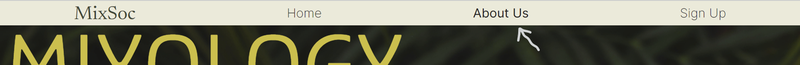
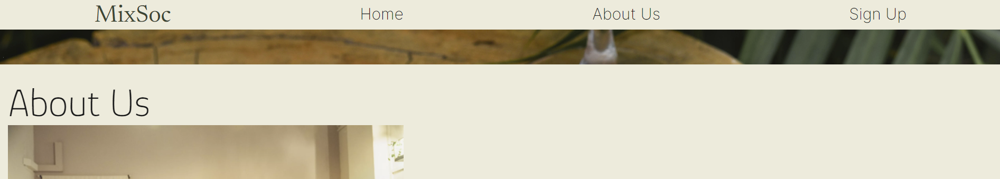
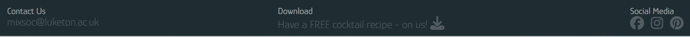
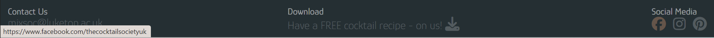

# Mixology Society

# Project Overview

Welcome,

This is the Mixology Society website, which provides information about the University of Luketon's Mixology Society.

The following are high-level details of this project:

- The main technologies used are HTML and CSS.
- The project consists of three separate web page sections (Home, About Us & Sign Up).
- A top navigation bar is established for information architecture.
- Git & GitHub are used for version control.
- Any external code sources used in the project are clearly identified in the code itself and in this README.md file
- The final version has been deployed via GitHub Pages.

The last update to this file was: **January 24th, 2024**

# Table of Contents

- [Mixology Society](#mixology-society)
- [Project Overview](#project-overview)
- [Table of Contents](#table-of-contents)
- [UX](#ux)
  - [User Goals](#user-goals)
  - [User Stories](#user-stories)
  - [Site Owners Goals](#site-owners-goals)
    - [Requirements](#requirements)
    - [Expectations](#expectations)
- [UI / Design Choices](#ui--design-choices)
  - [Moodboard](#moodboard)
  - [Fonts](#fonts)
  - [Icons](#icons)
  - [Colours](#colours)
  - [Breakpoints](#breakpoints)
  - [Wireframes](#wireframes)
- [Features](#features)
  - [Existing Features](#existing-features)
    - [Navigation Bar](#navigation-bar)
    - [Home Section](#home-section)
    - [About Us Section](#about-us-section)
    - [Sign Up Section](#sign-up-section)
    - [Footer](#footer)
  - [Future actions - Features to be Implemented](#future-actions---features-to-be-implemented)
- [Technologies used](#technologies-used)
  - [Languages](#languages)
  - [IDE](#ide)
  - [Libraries \& Framework](#libraries--framework)
  - [Tools](#tools)
- [Testing](#testing)
  - [Testing User Stories](#testing-user-stories)
  - [Debugging](#debugging)
  - [Unfixed Bugs](#unfixed-bugs)
- [Deployment](#deployment)
- [Credits](#credits)

# UX

## User Goals

1. Visually appealing, including images.
2. Easily navigated around.
3. Quality and valuable content.
4. Easily found contact details.
5. Form to directly contact the society club.

## User Stories

1. As a user, I want to know that the society club is well established.
2. As a user, I want to be able to easily contact the club.
3. As a user, I want to be able to make contact with the club via different methods, i.e. social media.
4. As a user, I want to be able to easily navigate through the website.
5. As a user, I want to know what events are taking place.
  
## Site Owners Goals

1. Promote the club.
2. Increase the number of members.
3. Increase rankings on search engines.
  
### Requirements

1. Easy to navigate on various screen sizes.
2. Clear information on the services provided.
3. Keep the user interested with the club's values to make them want to engage with the society club.
4. Simple methods of contacting the society club.
5. Visually inviting so users do not leave.
  
### Expectations

1. I expect to know if a form has been submitted properly and if items are not filled in, to be prompted.
2. I expect all links to social media sites to be opened in a new tab.
3. I expect all navigation links to work correctly.
4. I expect screen size not to affect the quality of the website.
5. I expect all information to be correct and accurate.

\
&nbsp;
[Back to Top](#table-of-contents)
\
&nbsp;

# UI / Design Choices

## Moodboard

One of the first milestones of this project was to create a moodboard to help envision the overall house style of the webiite and ensure that all of the sections and elements are cohesive. The software I used to create the moodboard for this website is [Mila Note](https://milanote.com/ "Mila Note").
Below, is the moodboard:

## Fonts

In order to move away from the basic fonts available, I have used
[Google Fonts](https://fonts.google.com/ "Google Fonts") to find a text that best suits the feel of the website. For the main text I have chosen [Glory](https://fonts.google.com/specimen/Glory "Glory font") as I feel it is has a sharp, simple and easy to read look. To make the navigation bar stand out form the text, I decided to use [Inter](https://fonts.google.com/specimen/Inter?query=inter "Inter font"). This font is complimentary to the Glory font, and will help be distinctive as navigation links in the header.

Additional Notes:

- I have intentionally imported the fonts in the css file and not index.html as it saved some space in the html file and as this is a static website, the slightly longer loading time is not critical.
  
- Backup fonts (sans-serif) have been put in place, in case the custom fonts used are not available.

- There is a 'double reset' in the css file. It simplifies calculate rem unit as I no longer need to think in scale factor of 1.6 but 10 instead.

## Icons

I will use some icons for my website from the [Font Awesome library](https://fontawesome.com/ "Font Awesome"). These icons will be used in the About Us Section and also the social media links in the footer. All icons used will be styled and in keeping with the appearance of the website.

## Colours

The colour scheme of the website is inspired by the moodboard (previously depicted). I have used [Coolers](https://coolors.co/ "coolers") to retrieve the desired colour codes and generate the colour palette.

Below, is the color palette:

## Breakpoints

As a starting point, I will be building my website with a mobile first mindset using the iPhone 5/SE (320px) as the smallest screen size for styling to look good on. The screen size breakpoints that I will be using are from [Bootstrap breakpoints](https://getbootstrap.com/docs/5.0/layout/breakpoints/ "Bootstrap").

| Screen Size | Class Infix | Breakpoint |
| ----------- | ----------- | ---------- |
| x-small     | none        | <576px     |
| small       | sm          | => 576px   |
| medium      | md          | => 768px   |
| large       | lg          | => 992px   |
| x-large     | xl          | => 1200px  |

\
&nbsp;
[Back to Top](#table-of-contents)
\
&nbsp;

## Wireframes

I have used [Balsamiq](https://balsamiq.com/wireframes/ "Balsamiq") to develop my wireframes for my website. I initially created the mobile version and then the wireframes and then scalled it up for both tablet and desktop. The website is a one-pager, that is split up into 3 sections. This gets the user through the content and quickly to the contact form and details via scrolling or directly via the navigation bar.

The wireframes are below:

[Home Section - Desktop Wireframe](wireframes/home-desktop-wireframe.png "home desktop wireframe")

[Home Section - Phone Wireframe](wireframes/home-phone-wireframe.png "home phone wireframe")

[About Section - Desktop Wireframe](wireframes/about-desktop-wireframe.png "about desktop wireframe")

[About Section - Phone Wireframe](wireframes/about-phone-wireframe.png "about phone wireframe")

[Sign Up Section - Desktop Wireframe](wireframes/signup-desktop-wireframe.png "signup desktop wireframe")

[Sign Up Section - Phone Wireframe](wireframes/signup-phone-wireframe.png "signup phone wireframe")

\
&nbsp;
[Back to Top](#table-of-contents)
\
&nbsp;

# Features

## Existing Features

### Navigation Bar

The navigation bar is responsive for various screen sizes. It includes links to fast-track to the respective sections within the one-page site.

- Spanning the entire width of the device, the navigation bar presents all the links (Home, About Us, Sign Up) in an organized manner; this provides a straight-forward and convenient user experience.
- The navigation bar for smaller devices which was initially a column that was supposed to expand and collapse has been replaced by a responsive version of the desktop's navigation bar as theres not that much content and will be able to fit in a row on a phone.

- In order for the user to identify which of the links their cursor is hovering over, the respective link text appears bold.

  
  \
  &nbsp;
- For the convenience of switching sections, the desktop navigation bar is permanently fixed at the top of the screen, so even if the user scrolls down, they will have access to it.

  
  \
  &nbsp;

\
&nbsp;
[Back to Top](#table-of-contents)
\
&nbsp;

### Home Section

- Background Image
  - The image immediately indicates what the club is about and fits the colour scheme.
  - The text informs the user on what the club is and what the website is about. The colours suit the colour scheme, the font style is appropriate for the club aesthetic. The text size and style is also easy to read and is eye-catching.
    \
    &nbsp;

    

\
&nbsp;
[Back to Top](#table-of-contents)
\
&nbsp;

### About Us Section

- This section outlines a brief introduction to the user on what the society club is about, the club's values and benefits.
- The photo of a few society members at an event is inviting and insightful of the society meet ups.
    \
    &nbsp;

    [About Us Section](docs/about-section.png)
    \
    &nbsp;

\
&nbsp;
[Back to Top](#table-of-contents)
\
&nbsp;

### Sign Up Section

- The Sign Up section enables the user to promptly send a membership request to the society, instead of reaching out to them by email.
    \
    &nbsp;

    
    \
    &nbsp;

- Both text fields are required fields and will not alow the user to submit until they are completed.
- There is a validation for the email field to ensure it is in a valid format.
    \
    &nbsp;

    
    \
    &nbsp;

  - Colour change is the hover effect on the submit button to confirm feature use that it is an active button.
    \
    &nbsp;

    
    \
    &nbsp;

- On submission of the form, the page is redirected to a submission confirmation; this notifies the user that their details have been received.
- Also, the user is informed that they can either wait for 5 seconds for the page to refresh back to the home section or click on the 'button' to do so.
- The 'button', which is actually a link changes color when hovered for improved user experience.
    \
    &nbsp;

    

- Additional Notes
  
  - The method of the form is a GET action of thank-you.html instead of a POST to CI form dump to avoid third-party personal data storage

\
&nbsp;
[Back to Top](#table-of-contents)
\
&nbsp;

### Footer

- The footer contains the social media links and contact information. These social links all open in a new tab and have an attribute of rel nonopener to act as a disclaimer.
    &nbsp;

    
    \
    &nbsp;

- There is also a hover effect over the links, again to improve user experience.
    \
    &nbsp;

    
    \
    &nbsp;

- An extra feature the footer has, is that users can download a free recipe in a pdf form. The download icon link also has a hover effect and the downloadable pdf opens up in a new tab. As a note, the pdf is for demo purposes.
    \
    &nbsp;

    
    \
    &nbsp;

## Future actions - Features to be Implemented

- For smaller devices, include hamburger icon that can open and close column navigation menu.
- Add a photo gallery section would be added to make the website more interactive and inviting.
- Add a section of the committee members with photos of each member, their names and position.
- Make the email address in the footer a link. It would open up the user's email browser in a pop up, with the society's email copied over.

\
&nbsp;
[Back to Top](#table-of-contents)
\
&nbsp;

# Technologies used

## Languages

- [HTML](https://en.wikipedia.org/wiki/HTML "HTML")
  
- [CSS](https://en.wikipedia.org/wiki/CSS "CSS")

## IDE

- [Codeanywhere](https://codeanywhere.com/ "Codeanywhere")

## Libraries & Framework

- [Google Fonts](https://fonts.google.com/ "Google Fonts")
  
- [Font Awesome library](https://fontawesome.com/ "Font Awesome")

## Tools

- [Mila Note](https://milanote.com/ "Mila Note")
  
- [Balsamiq](https://balsamiq.com/wireframes/ "Balsamiq")

- [CI Full Template](https://github.com/Code-Institute-Org/ci-full-template "CI Full Template")
  
- [Google Fonts](https://fonts.google.com/ "Google Fonts")

- [Coolers](https://coolors.co/ "coolers")

- [W3C HTML Validation Service](https://validator.w3.org/ "W3C HTML")
  
- [W3C CSS Validation Service](https://jigsaw.w3.org/css-validator/ "W3C CSS")

\
&nbsp;
[Back to Top](#table-of-contents)
\
&nbsp;

# Testing

## Testing User Stories

The first phase of testing consisted of personally navigating through the website to ensure the stories have been set. Below, I have listed the user stories set at the beginning of the project, along with screenshots evincing how they have each been met.
\
&nbsp;

1. As a user, I want to know that the society club is well established.
    
\
&nbsp;
    The aesthetic of the website typically depicts an establishment's officiality. I belive that the cohesive font and colour scheme, along with credible social links all cater towards this story.
\
&nbsp;
2. As a user, I want to be able to easily contact the club.
    
\
&nbsp;
    There is a sign up form that enables the user to immediately request membership to the society. Also, the website informs the user differents ways to contact the club, discussed in the next user story.
\
&nbsp;
3. As a user, I want to be able to make contact with the club via different methods, i.e. social media.
    
\
&nbsp;
4. As a user, I want to be able to easily navigate through the website.
    
\
&nbsp;
5. As a user, I want to know what events are taking place.
    
\
&nbsp;

## Debugging

These are the issues that emerged and how I resolved them:

- When I included the logo with the other social links in the ul, I wanted the logo to have a different formatting (i.e., font and colour) to the other a elements. To avoid adding the styling to the html file, I added the id to the selector to override the other navigation links formatting.
  
- Previously, I created media queries with min and max ranges, which resulted in very jagged results for the breakpoints. To resolve this, the css file by default is mobile-first and there is a media query for larger devices with only a min-width constraint, to make the responsive transition more smooth.
  
- I was having difficulty with setting font sizes so to counteract this, I have set a 'double reset' in the css file. It simplifies calculate rem unit as I no longer need to think in scale factor of 1.6 but 10 instead.
  
- The loading of the website was initially quite glitchy, even when scrolling, so to resolve this, I added a smooth scroll-behaviour attribute to the html selector within the css file.
  
- When the navigation links were clicked on, the section headings were slightly cut off at the top, so to improve the user experience, a scroll padding top attribute was added to the html selector within the css file.
  
- The background images were making the text/ other features less obvious so to make the website easier to read, I adjust the opacity of the background images to make the text pop more.
  
- During testing, the sign up confirmation page did not return back to the website but instead, an error showed up as it was to the codeanywhere workspace so this was resolved by ammending the URL in the thank-you.html file.
  
- Footer icons were too small for larger devices like desktop, so I've targeted the footer icons and increased their size (from 1rem to 2.5 rem) to make it easier for the users to click on.

- The css file has been cleaned up to avoid repetition of code and keep it concise.

- When I was validating HTML code, I had two errors and one warning showing. The key modification I did were cleaning the logo extra closing tag, which resolved the logo being another link to the home/ landing section, which it was not doing before. There were no errors or warnings to show for the other html file. There was also no errors shown for the css file in this project.
The results of my validation for HTML and CSS are below:
  - HTML (index.html) validator [results](wireframes/html-validation.png "W3C HTML")
  - HTML (thank-you.html) validator [results](wireframes/thankyou-html-validation.png "W3C HTML")
  - CSS validator [results](wireframes/css-valation.png "W3C CSS")
\
&nbsp;

## Unfixed Bugs

The project deliverable is for a module that only covers html and css, hence the current state of the hamburger menu feature for smaller devices is limited. Ideally a tap of the icon should open or close the menu for smaller devices. It currently does not do this. Based on research, it appears that the way to get around this is JavaScript, which will only be introduced in later modules.

\
&nbsp;
[Back to Top](#table-of-contents)
\
&nbsp;

# Deployment

This project was deployed using GitHub Pages through the following steps:

1. Navigating to the repository on github and click **Settings**.
2. Selecting **Pages** on the side navigation.
3. Selecting the **None** dropdown, and then clicking 'main'.
4. Clicking on the **Save** button.
5. Now the website is live on [MixSoc Live Website](https://rachelcluke.github.io/mixology-society/ "MixSoc Website")
6. If any changes are required, they can be done, commited and pushed to GitHub and the changes will be updated.

\
&nbsp;
[Back to Top](#table-of-contents)
\
&nbsp;

# Credits

For mentoring, code advising and project reviewing:

- [Simen Daehlin](https://github.com/Eventyret "Simen Daehlin")

For technical support and guidance:

- Tutors at Code Institute
  
- [Bootstrap Flex Doc](https://getbootstrap.com/docs/4.0/utilities/flex/ "Bootstrap Flex Doc")

For content inspiration:

- [Cardiff Cocktail Society](https://www.cardiffstudents.com/activities/society/cocktailsociety/ "Cardiff Cocktail Society")
  
- [Aber Cocktail Society](https://www.abersu.co.uk/society/cocktailsociety/ "Aber Cocktail Society")

---

Thank you - from Rachel Luke!

\
&nbsp;
[Back to Top](#table-of-contents)
